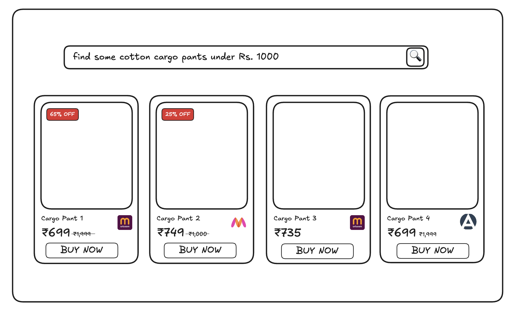

# Online Shopping Agent

## Architecture Overview

The following diagram illustrates the high-level architecture and workflow of the online shopping agent (It is quite self-explanatory and provides a clear overview of how the system works.):

## Use Cases

| Category | Use Cases | Status |
|----------|-----------|--------|
| **Handled** | Query Processing | ✅ |
| | - Cleaning user queries | ✅ |
| | - Validating user queries | ✅ |
| | - Structuring user queries | ✅ |
| | Product Scraping | ✅ |
| | - Parallel scraping from multiple platforms | ✅ |
| | - Standardized JSON output | ✅ |
| | - Product details (image, price, discount, platform) | ✅ |
| **Unhandled** | Real-time Updates | ❌ |
| | - Live progress updates during scraping | ❌ |
| | - Browser-based streaming of LLM responses | ❌ |
| | Log Processing | ❌ |
| | - File watcher service for log changes | ❌ |
| | - Custom log parser for non-standard formats | ❌ |

## User Interface Design

The application features a clean, minimalist interface designed for easy product discovery and comparison:

### Search Interface
- A search bar at the top with a search icon
- Natural language query support (e.g., "Find some cotton cargo pants under Rs. 1000")

### Product Display

- Products are displayed in a responsive grid layout
- Each product card contains:
  - Product image
  - Product name
  - Current price in INR (₹)
  - Original price (strikethrough when discounted)
  - Discount badge (e.g., "65% OFF", "25% OFF") in red
  - Platform/marketplace icon (e.g., Myntra, Amazon)
  - "BUY NOW" action button

The design prioritizes clarity and comparison shopping, making it easy for users to quickly scan multiple options across different platforms and make informed purchasing decisions.

### UX Considerations

#### Loading States and Real-time Feedback
- The product search and scraping process takes considerable time.
- Currently implemented: Basic skeleton loader for loading state
- Initially planned but not implemented: Live status updates during the search process
  - Real-time updates about which platforms are being searched
  - Progress indicators for data collection
  - Immediate display of products as they are found
  - Status messages about query processing and data validation

#### Implementation Challenges
- Technical Limitations:
  - Browser-use package limitations streaming of events
  - No built-in support for real-time status updates
- Resource Constraints:
  - Custom implementation would require:
    - File watcher service to monitor log updates
    - Custom log parser for structured data
    - UI components for streaming updates
  - These features were deprioritized due to time constraints
  - Current implementation uses a simpler loading state pattern

### Browser Automation Approach

#### Initial Consideration: Custom AI Browser Automation
- Planned to build an AI-powered automation system:
  - Using Playwright as the browser control foundation
  - Implementing AI for understanding page structure
  - Creating bounding boxes for element detection
  - Using LLM for element interaction decisions
  - Building autonomous navigation capabilities
- Development Complexity:
  - Building robust element detection systems
  - Significant development time investment

#### Adopted Solution: Browser-Use
- [Browser Use = state of the art Web Agent](https://browser-use.com/posts/sota-technical-report):
  - 89.1% success rate on WebVoyager benchmark
  - Tested across 586 diverse web tasks
  - Exceptional performance across major platforms:
    - E-commerce (Amazon: 92% success rate)
    - Search engines (Google Search: 90% success rate)
    - Travel sites (Booking.com: 80% success rate)
- Ready-to-use AI-powered automation:
  - Pre-built LLM-powered navigation
  - Existing vision-language integration
  - Mature element detection system
  - Proven autonomous browsing capabilities
- Benefits of adoption:
  - Immediate implementation
  - Production-ready solution
  - Fully open-source
  - Active community support
  - Focus on core product features

The discovery of browser-use eliminated the need to build a custom AI automation system, providing a battle-tested solution with proven performance across diverse web platforms.

### Prompt Engineering

#### Initial Approach
- Direct user query forwarding to LLM
- Challenges faced:
  - Vague and ambiguous user queries
  - Potential for prompt injection attacks
  - Inconsistent search results
  - Poor performance with unstructured queries

#### Enhanced Prompt Architecture
- Implemented a two-stage agent system:
  1. Query Processing Agent
     - Cleans and sanitizes user input
     - Validates query safety
     - Detects and prevents prompt injection attempts
     - Structures vague queries into standardized format
  2. Search Agent
     - Receives structured JSON from processing agent
     - Constructs optimized search strings
     - Ensures consistent product discovery across platforms

This structured approach:
- Improves search accuracy
- Prevents security vulnerabilities
- Handles edge cases gracefully
- Standardizes product discovery across platforms
- Reduces failed searches due to vague queries

### Browser-Use Agent Limitations

#### Schema Context Issues
- Initial Implementation Challenge:
  - Even with JSON schema provided to the main agent
  - Browser-use agents run in isolated contexts
  - Schema information wasn't propagated to scraping contexts
  - Resulted in missing or null values for required fields

#### Data Collection Inconsistencies
- Observed Issues:
  - Incomplete product information
  - Inconsistent data structure
  - Missing required fields
  - Null values for essential attributes

#### Implemented Solution
- Embedded schema information in task description
  - Added JSON schema directly in scraping task prompt
  - Ensures scraping agent has complete context
  - Guides the LLM during data collection
- Results:
  - More reliable data extraction
  - Consistent schema adherence
  - Better quality product information

This solution significantly improved the reliability of data collection.

